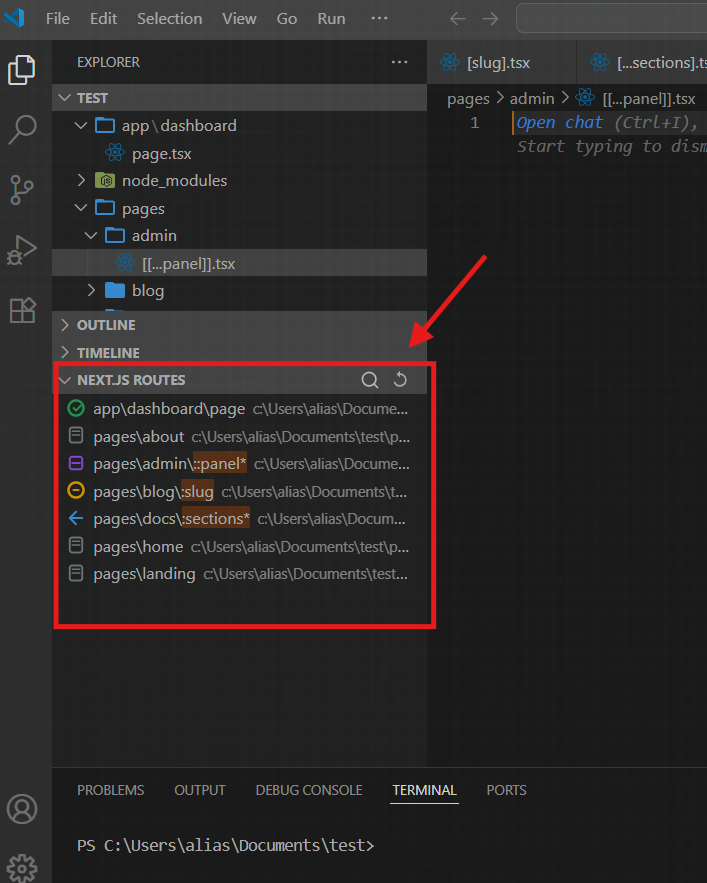

# 🧭 Next.js Smart Routing Visualizer

A powerful and elegant VS Code extension that **visualizes your Next.js routes** in a sidebar — supporting both `pages/` and `app/` directories. Easily detect and explore dynamic segments like `[slug]`, `[...params]`, and `[[...optional]]` in a tree structure.

---

## 🚀 Features

- 📂 Displays all routes from `pages/` and `app/` directories
- 🧩 Highlights dynamic route segments:
  - `[slug]` → dynamic
  - `[...slug]` → catch-all
  - `[[...slug]]` → optional catch-all
- 🎯 Inline file navigation (click to open route file)
- 🖼️ Custom icons for:
  - App routes
  - Page routes
  - Dynamic / Catch-all routes
- ♻️ Auto-refresh on file changes
- 🔎 Highlights route parameters 

---

## 🛠️ How It Works

- Parses all `*.js`, `*.ts`, `*.jsx`, `*.tsx` files inside `pages/` and `app/` directories
- Ignores `node_modules`
- Replaces dynamic segments (`[slug]`) with symbolic labels (e.g., `:slug`)
- Maps route files into a collapsible VS Code `TreeView`

---

## 🧑‍💻 Usage

1. Open a Next.js project in VS Code.
2. Open the sidebar panel called **Next.js Routes**.
3. Explore your route structure interactively.
4. Click any route to open the corresponding file.

---

## 📦 Installation

You can install from the [Visual Studio Marketplace](https://marketplace.visualstudio.com/) once published or manually:

